<br>
<br>

# Capítulo 1. Regresión Lineal Simple


<br>

## <span style="color:#18bc9c">Correlación</span>

<br>

### Ejercicio 1.1. \
<br>
En el archivo grasacerdos.xlsx se encuentran los datos del peso
vivo (PV, en Kg) y al espesor de grasa dorsal (EGD, en mm) de 30 lechones
elegidos al azar de una población de porcinos Duroc Jersey del Oeste de la
provincia de Buenos Aires. Se pide: \
<br>
(a) Dibujar el diagrama de dispersión e interpretarlo.\
<br>
(b) Calcular el coeficiente de correlación muestral y explíquelo.\
<br>
(c) ¿Hay suficiente evidencia para admitir asociación entre el peso y el espesor de grasa? $(\alpha = 0,05)$. Verifique los supuestos para decidir el indicador
que va a utilizar.\


```
## # A tibble: 5 × 3
##     Obs PV    EGD  
##   <dbl> <chr> <chr>
## 1     1 56,81 16,19
## 2     2 70,40 22,00
## 3     3 71,73 19,52
## 4     4 75,10 31,00
## 5     5 79,65 23,58
```
Cambiamos las "," por "." y visualizamos cuantos nulos hay  por columna. Convertimos las columnas de PV y EGD a numéricas. Pedimos el summary del dataframe. 


```
## tibble [30 × 3] (S3: tbl_df/tbl/data.frame)
##  $ Obs: num [1:30] 1 2 3 4 5 6 7 8 9 10 ...
##  $ PV : chr [1:30] "56.81" "70.40" "71.73" "75.10" ...
##  $ EGD: chr [1:30] "16.19" "22.00" "19.52" "31.00" ...
## NULL
```

```
## Obs  PV EGD 
##   0   0   0
```

```
##        PV             EGD       
##  Min.   :27.51   Min.   : 7.29  
##  1st Qu.:55.47   1st Qu.:16.47  
##  Median :64.94   Median :21.55  
##  Mean   :63.07   Mean   :21.60  
##  3rd Qu.:70.15   3rd Qu.:25.92  
##  Max.   :93.00   Max.   :40.90
```
<br>

#### (a) 


<!-- -->
<!-- -->
En los datos visualizados  no pareciera haber asociación entre las variables. 

#### (b)
<br>
En primer lugar analizo la normalidad de las variables mediante los gráficos de los histogramas, los qqplots y la prueba de Shapiro.
<!-- -->
<!-- -->

```
## 
## 	Shapiro-Wilk normality test
## 
## data:  PV
## W = 0.97533, p-value = 0.6925
```


```
## 
## 	Shapiro-Wilk normality test
## 
## data:  EGD
## W = 0.98514, p-value = 0.9395
```
Por el test de Shapiro Wilk no se puede rechazar la normalidad de los datos en ninguno de los dos casos. 
<br>
Análisis de la normalidad multivariada - Test de Henze Zirkler


``` r
#Análisis de normalidad bivariada 
library(MVN)
attach(grasacerdos)
peso_egd=data.frame(PV,EGD)
#Usamos Test Henze-Zirkler para evaluar normalidad multivariada (bivariada en este caso)
respuesta_testHZ<-mvn(peso_egd , mvnTest = "hz")
print(respuesta_testHZ$multivariateNormality)
```

```
##            Test        HZ   p value MVN
## 1 Henze-Zirkler 0.2539437 0.9049686 YES
```
El test da por resultado que las variables son normales bivariadas.

La correlación entre ambas variables es:


```
## [1] 0.2543434
```
La correlación entre las variables es baja: Si el valor de r es cercano a 0, indica que no existe una tendencia
creciente o decreciente entre las variables estudiadas.


```
## 
## 	Pearson's product-moment correlation
## 
## data:  PV and EGD
## t = 1.3916, df = 28, p-value = 0.175
## alternative hypothesis: true correlation is not equal to 0
## 95 percent confidence interval:
##  -0.1166112  0.5630217
## sample estimates:
##       cor 
## 0.2543434
```
El test arroja que el valor p de la prueba de Pearson es 0.175. 


```
##            PV       EGD
## PV  1.0000000 0.2543434
## EGD 0.2543434 1.0000000
```
Si bien no es necesario aplicar el coeficiente de Spearman pues se satisfacen los supuestos, igualmente lo hago.


```
## 
## 	Spearman's rank correlation rho
## 
## data:  PV and EGD
## S = 3748, p-value = 0.3785
## alternative hypothesis: true rho is not equal to 0
## sample estimates:
##       rho 
## 0.1661846
```

### Ejercicio 1.2.
<br>

Los datos del cuarteto de Anscombe se encuentran en el archivo
 anscombe.xlsx
 Se pide explorar los datos de la siguiente manera:\
 <br>
 (a) Graficar los cuatro pares de datos en un diagrama de dispersión cada
 uno.\
 <br>
 (b) Hallar los valores medios de las variables para cada para de datos.\
<br> (c) Hallar los valores de la dispersión para cada conjunto de datos.\
 <br>(d) Hallar el coeficiente muestral de correlación lineal en cada caso.\
 <br>(e) Observar, comentar y concluir.\
 <br>
 
#### (a)


<!-- -->

#### (b)


```{=html}
<div id="ieddfsvpuo" style="padding-left:0px;padding-right:0px;padding-top:10px;padding-bottom:10px;overflow-x:auto;overflow-y:auto;width:auto;height:auto;">
<style>#ieddfsvpuo table {
  font-family: system-ui, 'Segoe UI', Roboto, Helvetica, Arial, sans-serif, 'Apple Color Emoji', 'Segoe UI Emoji', 'Segoe UI Symbol', 'Noto Color Emoji';
  -webkit-font-smoothing: antialiased;
  -moz-osx-font-smoothing: grayscale;
}

#ieddfsvpuo thead, #ieddfsvpuo tbody, #ieddfsvpuo tfoot, #ieddfsvpuo tr, #ieddfsvpuo td, #ieddfsvpuo th {
  border-style: none;
}

#ieddfsvpuo p {
  margin: 0;
  padding: 0;
}

#ieddfsvpuo .gt_table {
  display: table;
  border-collapse: collapse;
  line-height: normal;
  margin-left: auto;
  margin-right: auto;
  color: #333333;
  font-size: 16px;
  font-weight: normal;
  font-style: normal;
  background-color: #FFFFFF;
  width: auto;
  border-top-style: solid;
  border-top-width: 2px;
  border-top-color: #A8A8A8;
  border-right-style: none;
  border-right-width: 2px;
  border-right-color: #D3D3D3;
  border-bottom-style: solid;
  border-bottom-width: 2px;
  border-bottom-color: #A8A8A8;
  border-left-style: none;
  border-left-width: 2px;
  border-left-color: #D3D3D3;
}

#ieddfsvpuo .gt_caption {
  padding-top: 4px;
  padding-bottom: 4px;
}

#ieddfsvpuo .gt_title {
  color: #333333;
  font-size: 125%;
  font-weight: initial;
  padding-top: 4px;
  padding-bottom: 4px;
  padding-left: 5px;
  padding-right: 5px;
  border-bottom-color: #FFFFFF;
  border-bottom-width: 0;
}

#ieddfsvpuo .gt_subtitle {
  color: #333333;
  font-size: 85%;
  font-weight: initial;
  padding-top: 3px;
  padding-bottom: 5px;
  padding-left: 5px;
  padding-right: 5px;
  border-top-color: #FFFFFF;
  border-top-width: 0;
}

#ieddfsvpuo .gt_heading {
  background-color: #FFFFFF;
  text-align: center;
  border-bottom-color: #FFFFFF;
  border-left-style: none;
  border-left-width: 1px;
  border-left-color: #D3D3D3;
  border-right-style: none;
  border-right-width: 1px;
  border-right-color: #D3D3D3;
}

#ieddfsvpuo .gt_bottom_border {
  border-bottom-style: solid;
  border-bottom-width: 2px;
  border-bottom-color: #D3D3D3;
}

#ieddfsvpuo .gt_col_headings {
  border-top-style: solid;
  border-top-width: 2px;
  border-top-color: #D3D3D3;
  border-bottom-style: solid;
  border-bottom-width: 2px;
  border-bottom-color: #D3D3D3;
  border-left-style: none;
  border-left-width: 1px;
  border-left-color: #D3D3D3;
  border-right-style: none;
  border-right-width: 1px;
  border-right-color: #D3D3D3;
}

#ieddfsvpuo .gt_col_heading {
  color: #333333;
  background-color: #FFFFFF;
  font-size: 100%;
  font-weight: normal;
  text-transform: inherit;
  border-left-style: none;
  border-left-width: 1px;
  border-left-color: #D3D3D3;
  border-right-style: none;
  border-right-width: 1px;
  border-right-color: #D3D3D3;
  vertical-align: bottom;
  padding-top: 5px;
  padding-bottom: 6px;
  padding-left: 5px;
  padding-right: 5px;
  overflow-x: hidden;
}

#ieddfsvpuo .gt_column_spanner_outer {
  color: #333333;
  background-color: #FFFFFF;
  font-size: 100%;
  font-weight: normal;
  text-transform: inherit;
  padding-top: 0;
  padding-bottom: 0;
  padding-left: 4px;
  padding-right: 4px;
}

#ieddfsvpuo .gt_column_spanner_outer:first-child {
  padding-left: 0;
}

#ieddfsvpuo .gt_column_spanner_outer:last-child {
  padding-right: 0;
}

#ieddfsvpuo .gt_column_spanner {
  border-bottom-style: solid;
  border-bottom-width: 2px;
  border-bottom-color: #D3D3D3;
  vertical-align: bottom;
  padding-top: 5px;
  padding-bottom: 5px;
  overflow-x: hidden;
  display: inline-block;
  width: 100%;
}

#ieddfsvpuo .gt_spanner_row {
  border-bottom-style: hidden;
}

#ieddfsvpuo .gt_group_heading {
  padding-top: 8px;
  padding-bottom: 8px;
  padding-left: 5px;
  padding-right: 5px;
  color: #333333;
  background-color: #FFFFFF;
  font-size: 100%;
  font-weight: initial;
  text-transform: inherit;
  border-top-style: solid;
  border-top-width: 2px;
  border-top-color: #D3D3D3;
  border-bottom-style: solid;
  border-bottom-width: 2px;
  border-bottom-color: #D3D3D3;
  border-left-style: none;
  border-left-width: 1px;
  border-left-color: #D3D3D3;
  border-right-style: none;
  border-right-width: 1px;
  border-right-color: #D3D3D3;
  vertical-align: middle;
  text-align: left;
}

#ieddfsvpuo .gt_empty_group_heading {
  padding: 0.5px;
  color: #333333;
  background-color: #FFFFFF;
  font-size: 100%;
  font-weight: initial;
  border-top-style: solid;
  border-top-width: 2px;
  border-top-color: #D3D3D3;
  border-bottom-style: solid;
  border-bottom-width: 2px;
  border-bottom-color: #D3D3D3;
  vertical-align: middle;
}

#ieddfsvpuo .gt_from_md > :first-child {
  margin-top: 0;
}

#ieddfsvpuo .gt_from_md > :last-child {
  margin-bottom: 0;
}

#ieddfsvpuo .gt_row {
  padding-top: 8px;
  padding-bottom: 8px;
  padding-left: 5px;
  padding-right: 5px;
  margin: 10px;
  border-top-style: solid;
  border-top-width: 1px;
  border-top-color: #D3D3D3;
  border-left-style: none;
  border-left-width: 1px;
  border-left-color: #D3D3D3;
  border-right-style: none;
  border-right-width: 1px;
  border-right-color: #D3D3D3;
  vertical-align: middle;
  overflow-x: hidden;
}

#ieddfsvpuo .gt_stub {
  color: #333333;
  background-color: #FFFFFF;
  font-size: 100%;
  font-weight: initial;
  text-transform: inherit;
  border-right-style: solid;
  border-right-width: 2px;
  border-right-color: #D3D3D3;
  padding-left: 5px;
  padding-right: 5px;
}

#ieddfsvpuo .gt_stub_row_group {
  color: #333333;
  background-color: #FFFFFF;
  font-size: 100%;
  font-weight: initial;
  text-transform: inherit;
  border-right-style: solid;
  border-right-width: 2px;
  border-right-color: #D3D3D3;
  padding-left: 5px;
  padding-right: 5px;
  vertical-align: top;
}

#ieddfsvpuo .gt_row_group_first td {
  border-top-width: 2px;
}

#ieddfsvpuo .gt_row_group_first th {
  border-top-width: 2px;
}

#ieddfsvpuo .gt_summary_row {
  color: #333333;
  background-color: #FFFFFF;
  text-transform: inherit;
  padding-top: 8px;
  padding-bottom: 8px;
  padding-left: 5px;
  padding-right: 5px;
}

#ieddfsvpuo .gt_first_summary_row {
  border-top-style: solid;
  border-top-color: #D3D3D3;
}

#ieddfsvpuo .gt_first_summary_row.thick {
  border-top-width: 2px;
}

#ieddfsvpuo .gt_last_summary_row {
  padding-top: 8px;
  padding-bottom: 8px;
  padding-left: 5px;
  padding-right: 5px;
  border-bottom-style: solid;
  border-bottom-width: 2px;
  border-bottom-color: #D3D3D3;
}

#ieddfsvpuo .gt_grand_summary_row {
  color: #333333;
  background-color: #FFFFFF;
  text-transform: inherit;
  padding-top: 8px;
  padding-bottom: 8px;
  padding-left: 5px;
  padding-right: 5px;
}

#ieddfsvpuo .gt_first_grand_summary_row {
  padding-top: 8px;
  padding-bottom: 8px;
  padding-left: 5px;
  padding-right: 5px;
  border-top-style: double;
  border-top-width: 6px;
  border-top-color: #D3D3D3;
}

#ieddfsvpuo .gt_last_grand_summary_row_top {
  padding-top: 8px;
  padding-bottom: 8px;
  padding-left: 5px;
  padding-right: 5px;
  border-bottom-style: double;
  border-bottom-width: 6px;
  border-bottom-color: #D3D3D3;
}

#ieddfsvpuo .gt_striped {
  background-color: rgba(128, 128, 128, 0.05);
}

#ieddfsvpuo .gt_table_body {
  border-top-style: solid;
  border-top-width: 2px;
  border-top-color: #D3D3D3;
  border-bottom-style: solid;
  border-bottom-width: 2px;
  border-bottom-color: #D3D3D3;
}

#ieddfsvpuo .gt_footnotes {
  color: #333333;
  background-color: #FFFFFF;
  border-bottom-style: none;
  border-bottom-width: 2px;
  border-bottom-color: #D3D3D3;
  border-left-style: none;
  border-left-width: 2px;
  border-left-color: #D3D3D3;
  border-right-style: none;
  border-right-width: 2px;
  border-right-color: #D3D3D3;
}

#ieddfsvpuo .gt_footnote {
  margin: 0px;
  font-size: 90%;
  padding-top: 4px;
  padding-bottom: 4px;
  padding-left: 5px;
  padding-right: 5px;
}

#ieddfsvpuo .gt_sourcenotes {
  color: #333333;
  background-color: #FFFFFF;
  border-bottom-style: none;
  border-bottom-width: 2px;
  border-bottom-color: #D3D3D3;
  border-left-style: none;
  border-left-width: 2px;
  border-left-color: #D3D3D3;
  border-right-style: none;
  border-right-width: 2px;
  border-right-color: #D3D3D3;
}

#ieddfsvpuo .gt_sourcenote {
  font-size: 90%;
  padding-top: 4px;
  padding-bottom: 4px;
  padding-left: 5px;
  padding-right: 5px;
}

#ieddfsvpuo .gt_left {
  text-align: left;
}

#ieddfsvpuo .gt_center {
  text-align: center;
}

#ieddfsvpuo .gt_right {
  text-align: right;
  font-variant-numeric: tabular-nums;
}

#ieddfsvpuo .gt_font_normal {
  font-weight: normal;
}

#ieddfsvpuo .gt_font_bold {
  font-weight: bold;
}

#ieddfsvpuo .gt_font_italic {
  font-style: italic;
}

#ieddfsvpuo .gt_super {
  font-size: 65%;
}

#ieddfsvpuo .gt_footnote_marks {
  font-size: 75%;
  vertical-align: 0.4em;
  position: initial;
}

#ieddfsvpuo .gt_asterisk {
  font-size: 100%;
  vertical-align: 0;
}

#ieddfsvpuo .gt_indent_1 {
  text-indent: 5px;
}

#ieddfsvpuo .gt_indent_2 {
  text-indent: 10px;
}

#ieddfsvpuo .gt_indent_3 {
  text-indent: 15px;
}

#ieddfsvpuo .gt_indent_4 {
  text-indent: 20px;
}

#ieddfsvpuo .gt_indent_5 {
  text-indent: 25px;
}

#ieddfsvpuo .katex-display {
  display: inline-flex !important;
  margin-bottom: 0.75em !important;
}

#ieddfsvpuo div.Reactable > div.rt-table > div.rt-thead > div.rt-tr.rt-tr-group-header > div.rt-th-group:after {
  height: 0px !important;
}
</style>
<table class="gt_table" data-quarto-disable-processing="false" data-quarto-bootstrap="false">
  <thead>
    <tr class="gt_col_headings">
      <th class="gt_col_heading gt_columns_bottom_border gt_left" rowspan="1" colspan="1" scope="col" id="Grupo">Grupo</th>
      <th class="gt_col_heading gt_columns_bottom_border gt_right" rowspan="1" colspan="1" scope="col" id="media_x">media_x</th>
      <th class="gt_col_heading gt_columns_bottom_border gt_right" rowspan="1" colspan="1" scope="col" id="media_y">media_y</th>
      <th class="gt_col_heading gt_columns_bottom_border gt_right" rowspan="1" colspan="1" scope="col" id="var_x">var_x</th>
      <th class="gt_col_heading gt_columns_bottom_border gt_right" rowspan="1" colspan="1" scope="col" id="var_y">var_y</th>
      <th class="gt_col_heading gt_columns_bottom_border gt_right" rowspan="1" colspan="1" scope="col" id="correl">correl</th>
      <th class="gt_col_heading gt_columns_bottom_border gt_right" rowspan="1" colspan="1" scope="col" id="rcuad">rcuad</th>
    </tr>
  </thead>
  <tbody class="gt_table_body">
    <tr><td headers="Grupo" class="gt_row gt_left">Grupo 1</td>
<td headers="media_x" class="gt_row gt_right">9</td>
<td headers="media_y" class="gt_row gt_right">7.500909</td>
<td headers="var_x" class="gt_row gt_right">11</td>
<td headers="var_y" class="gt_row gt_right">4.127269</td>
<td headers="correl" class="gt_row gt_right">0.8164205</td>
<td headers="rcuad" class="gt_row gt_right">0.6665425</td></tr>
    <tr><td headers="Grupo" class="gt_row gt_left">Grupo 2</td>
<td headers="media_x" class="gt_row gt_right">9</td>
<td headers="media_y" class="gt_row gt_right">7.500909</td>
<td headers="var_x" class="gt_row gt_right">11</td>
<td headers="var_y" class="gt_row gt_right">4.127629</td>
<td headers="correl" class="gt_row gt_right">0.8162365</td>
<td headers="rcuad" class="gt_row gt_right">0.6662420</td></tr>
    <tr><td headers="Grupo" class="gt_row gt_left">Grupo 3</td>
<td headers="media_x" class="gt_row gt_right">9</td>
<td headers="media_y" class="gt_row gt_right">7.500000</td>
<td headers="var_x" class="gt_row gt_right">11</td>
<td headers="var_y" class="gt_row gt_right">4.122620</td>
<td headers="correl" class="gt_row gt_right">0.8162867</td>
<td headers="rcuad" class="gt_row gt_right">0.6663240</td></tr>
    <tr><td headers="Grupo" class="gt_row gt_left">Grupo 4</td>
<td headers="media_x" class="gt_row gt_right">9</td>
<td headers="media_y" class="gt_row gt_right">7.500909</td>
<td headers="var_x" class="gt_row gt_right">11</td>
<td headers="var_y" class="gt_row gt_right">4.123249</td>
<td headers="correl" class="gt_row gt_right">0.8165214</td>
<td headers="rcuad" class="gt_row gt_right">0.6667073</td></tr>
  </tbody>
  
  
</table>
</div>
```
## <span style="color:#18bc9c"> Modelo Lineal Simple</span>
<br>

### Ejercicio 1.3. \
<br>
El archivo peso_edad_colest.xlsx disponible en contiene regis
tros correspondientes a 25 individuos respecto de su peso, su edad y el nivel
 de colesterol total en sangre.
 Se pide: \
 <br>
 (a) Realizar el diagrama de dispersión de colesterol en función de la edad y
 de colesterol en función de peso. Le parece adecuado ajustar un modelo
 lineal para alguno de estos dos pares de variables?\
  <br>
 (b) Estime los coeficientes del modelo lineal para el colesterol en función de
 la edad.\
  <br>
 (c) Estime intervalos de confianza del 95% para los coeficientes del modelo
 y compare estos resultados con el test de Wald para los coeficientes. Le
 parece que hay asociación entre estos test y el test de la regresión?\
  <br>
 (d) A partir de esta recta estime los valores de E(Y) para x = 25 años y
 x =48años. Podría estimarse el valor de E(Y) para x = 80 años? \
  <br>
 (e) Testee la normalidad de los residuos y haga un gráfico para ver si son
 homocedásticos.\
  <br>

#### (a)

<!-- -->
Viendo los gráficos de dispersión, pareciera  que el colesterol en función de la edad tiene una relación lineal más clara que el colesterol en función del peso. Por lo tanto, es más adecuado ajustar un modelo lineal para el colesterol en función de la edad.  

#### (b)


```
## 
## Call:
## lm(formula = colest ~ edad, data = peso_edad_colest)
## 
## Residuals:
##     Min      1Q  Median      3Q     Max 
## -68.311 -22.602  -2.627  27.589  85.348 
## 
## Coefficients:
##             Estimate Std. Error t value Pr(>|t|)    
## (Intercept)  95.5020    26.2545   3.638  0.00138 ** 
## edad          5.6708     0.6345   8.937 6.09e-09 ***
## ---
## Signif. codes:  0 '***' 0.001 '**' 0.01 '*' 0.05 '.' 0.1 ' ' 1
## 
## Residual standard error: 39.69 on 23 degrees of freedom
## Multiple R-squared:  0.7764,	Adjusted R-squared:  0.7667 
## F-statistic: 79.87 on 1 and 23 DF,  p-value: 6.094e-09
```

```
## Analysis of Variance Table
## 
## Response: colest
##           Df Sum Sq Mean Sq F value    Pr(>F)    
## edad       1 125809  125809  79.871 6.094e-09 ***
## Residuals 23  36228    1575                      
## ---
## Signif. codes:  0 '***' 0.001 '**' 0.01 '*' 0.05 '.' 0.1 ' ' 1
```


```
## [1] 5.670842
```


```
## [1] 0.8811468
```

#### (c)

Test de Wald para los coeficientes del modelo:


``` r
library(aod)
wald.test(b = coef(modelo_edad), Sigma = vcov(modelo_edad), Terms = 1:2) # chequeo B0 y B1
```

```
## Wald test:
## ----------
## 
## Chi-squared test:
## X2 = 1696.6, df = 2, P(> X2) = 0.0
```
La prueba arroja que el valor p para la prueba de Wald es menor a 0.05, por lo que se rechaza la hipótesis nula de que los coeficientes son iguales a cero. Esto indica que hay evidencia para suponer una asociación significativa entre la edad y el colesterol total en sangre.\
<br>
Los intervalos de confianza a nivel 95% para los coeficientes del modelo son:


``` r
confint(modelo_edad, level = 0.95)
```

```
##                 2.5 %     97.5 %
## (Intercept) 41.190390 149.813618
## edad         4.358216   6.983467
```
Tanto los resultados del test de Wald como los intervalos de confianza coinciden que los coeficientes de la regresión son diferentes a cero. 

#### (d)


 
 

```
## [1] "La estimación para x=25 es 237.273046092184"
```

```
## [1] "La estimación para x= 48 es  367.702404809619"
```

``` r
# Estimación de E(Y) para x = 80
 print(max(peso_edad_colest$edad))
```

```
## [1] 60
```

``` r
 print(min(peso_edad_colest$edad))
```

```
## [1] 20
```
Como los datos de edad que tenemos son toma los valores entre 20 y 60, no es posible realizar una estimación para X=80.

#### (e)  

Análisis de la normalidad de los residuos del modelo: \
<br>

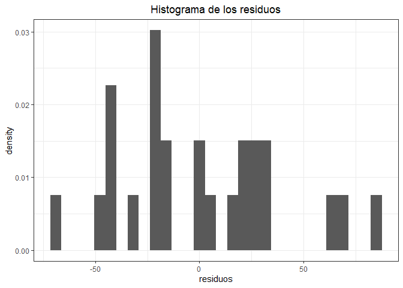<!-- -->
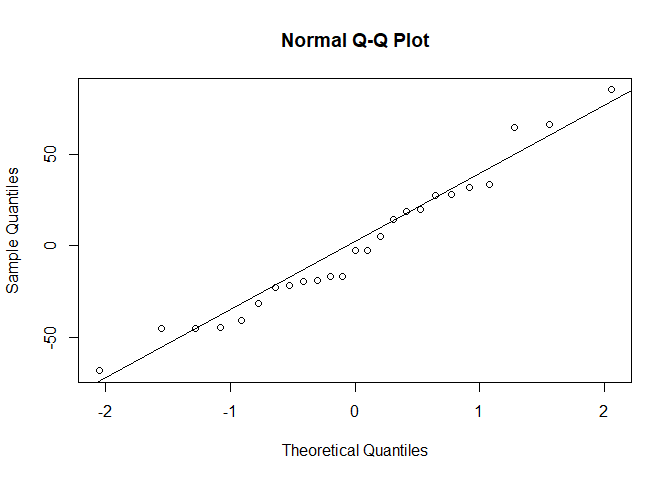<!-- -->

```
## 
## 	Shapiro-Wilk normality test
## 
## data:  modelo_edad$residuals
## W = 0.96478, p-value = 0.5175
```
  
  
El p-valor de la prueba de Shapiro-Wilk es 0.5175, lo que indica que no se puede rechazar la hipótesis nula de normalidad de los residuos. \
<br>
Análisis de la homocedasticidad de los residuos del modelo: \

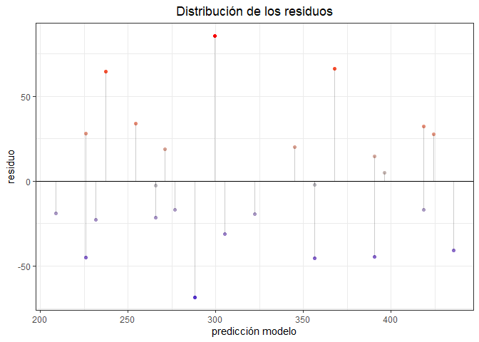<!-- -->
No se observa estructura en los residuos del modelo. \
<br>
Test de Breusch-Pagan para la homocedasticidad: \

``` r
library(lmtest)
bptest(modelo_edad)
```

```
## 
## 	studentized Breusch-Pagan test
## 
## data:  modelo_edad
## BP = 0.15821, df = 1, p-value = 0.6908
```
El p-value de la Prueba de Breusch-PAgan es 0.6908, por lo que no se rechaza la hipótesis nula de homocedasticidad. \
<br>
Gráfico de análisis de independencia de las observaciones.\

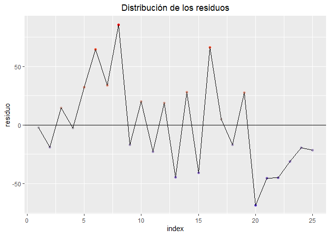<!-- -->
No se detecta ningún patrón en el gráfico de los residuos.\
<br>
Test de Durbin-Watson para analizar la autocorrelación de los residuos:


``` r
library(car)
dwtest(modelo_edad)
```

```
## 
## 	Durbin-Watson test
## 
## data:  modelo_edad
## DW = 1.7831, p-value = 0.3174
## alternative hypothesis: true autocorrelation is greater than 0
```
No se rechaza la  NO AUTOCORRELACIÓN de los residuos. Se valida el supuesto de independencia de las observaciones.\

<br>

## <span style="color:#18bc9c">Transformación de Variables</span>

<br>

### Ejercicio 1.4.\ PREGUNTAR
<br>
Una empresa desarrolló un sistema de energía solar para calentar el agua para una caldera que es parte del sistema de energía del proceso
productivo. Existe el interés de controlar la estabilidad del sistema, para ello
se monitorea el mismo y se registran los datos cada hora. Los datos se encuentran disponibles en el archivo energia.xlsx.\
<br>
(a) Realizar el diagrama de dispersión y evaluar si un modelo de regresión
lineal es adecuado.\
<br>
(b) Estimar un modelo lineal y verificar la normalidad de los residuos del
mismo.\
<br>
(c) En caso de rechazar este supuesto buscar una transformación lineal para
este modelo y aplicarla.\
<br>
(d) Realizar el análisis diagnóstico del nuevo modelo y estimar un intervalo
de confianza y un intervalo de predicción para 27.5 hs con ambos modelos. Comparar los intervalos.\
<br>


```
##       Hora          Energía     
##  Min.   : 1.00   Min.   :375.0  
##  1st Qu.:12.75   1st Qu.:444.5  
##  Median :24.50   Median :482.5  
##  Mean   :24.50   Mean   :504.2  
##  3rd Qu.:36.25   3rd Qu.:535.5  
##  Max.   :48.00   Max.   :782.0
```
#### (a)


```
## # A tibble: 3 × 2
##    Hora Energía
##   <dbl>   <dbl>
## 1     1     598
## 2     2     527
## 3     3     530
```

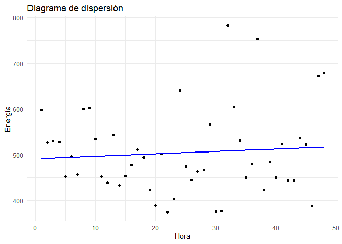<!-- -->
<br>
Por lo visto en el diagrama de dispersión no pareciera haber una relación lineal entre las variables. \

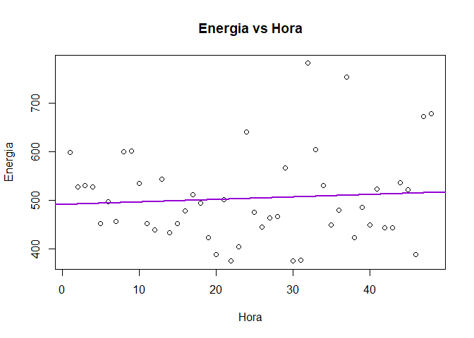<!-- -->

<br>

#### (b)


```
## 
## Call:
## lm(formula = Energía ~ Hora, data = energia)
## 
## Residuals:
##     Min      1Q  Median      3Q     Max 
## -131.12  -60.60  -24.31   37.29  273.84 
## 
## Coefficients:
##             Estimate Std. Error t value Pr(>|t|)    
## (Intercept) 491.4894    27.5044  17.869   <2e-16 ***
## Hora          0.5208     0.9772   0.533    0.597    
## ---
## Signif. codes:  0 '***' 0.001 '**' 0.01 '*' 0.05 '.' 0.1 ' ' 1
## 
## Residual standard error: 93.79 on 46 degrees of freedom
## Multiple R-squared:  0.006138,	Adjusted R-squared:  -0.01547 
## F-statistic: 0.2841 on 1 and 46 DF,  p-value: 0.5966
```

```
## [1] 0.006137505
```

Para verificar la normalidad de los residuos hacemos uso del test de Shapiro Wilk.

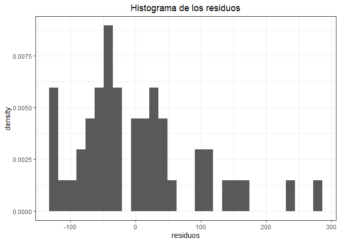<!-- -->
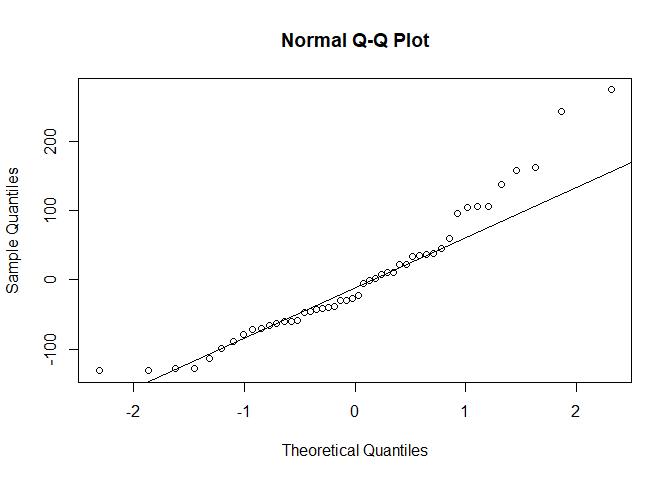<!-- -->

```
## 
## 	Shapiro-Wilk normality test
## 
## data:  linMod$residuals
## W = 0.92988, p-value = 0.006752
```
El test de Shapiro Wilk arroja un p-value de 0.006752, por lo que se rechaza la hipótesis nula de normalidad de los residuos. \


#### (c) 
<br>
Como se rechazó la hipótesis nula de normalidad de los residuos, se procede a realizar una transformación de las variables.

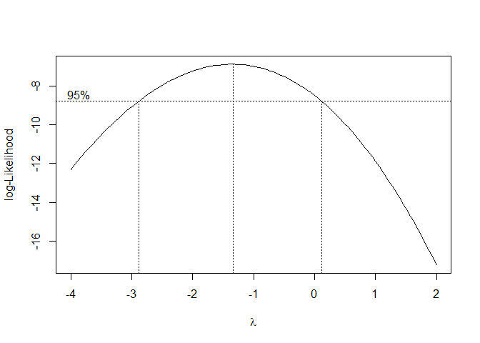<!-- -->

```
## [1] -1.333333
```
Se pudo aplicar el Box y Cox porque las variable respuesta tomaba valores positivos. Observando el gráfico se ve que el lambda óptimo es de -1.3 aproximadamente. \

Como la forma de estras transformaciones es 

$$
L(y) =
\begin{cases}
\displaystyle \frac{y^{\lambda} - 1}{\lambda}, & \text{si } \lambda \ne 0 \\
\ln(y), & \text{si } \lambda = 0
\end{cases}
$$
en este caso $\lambda \ne 0$, por lo tanto la transformación es:

$$L(y)=\frac{y^{-1.33}-1}{-1.33}$$

``` r
energia$lambda_optimo <- (energia$Energía^lambda_optimo -1)/lambda_optimo

modelo_transformado <- lm(lambda_optimo ~ Hora, data = energia)

summary(modelo_transformado)
```

```
## 
## Call:
## lm(formula = lambda_optimo ~ Hora, data = energia)
## 
## Residuals:
##        Min         1Q     Median         3Q        Max 
## -8.172e-05 -2.552e-05 -2.685e-06  2.318e-05  9.145e-05 
## 
## Coefficients:
##              Estimate Std. Error   t value Pr(>|t|)    
## (Intercept) 7.498e-01  1.268e-05 59110.662   <2e-16 ***
## Hora        7.952e-09  4.507e-07     0.018    0.986    
## ---
## Signif. codes:  0 '***' 0.001 '**' 0.01 '*' 0.05 '.' 0.1 ' ' 1
## 
## Residual standard error: 4.326e-05 on 46 degrees of freedom
## Multiple R-squared:  6.768e-06,	Adjusted R-squared:  -0.02173 
## F-statistic: 0.0003113 on 1 and 46 DF,  p-value: 0.986
```
#### (d)
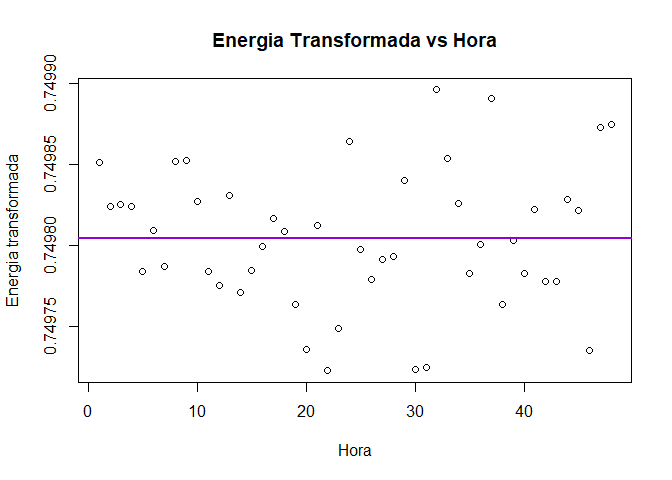<!-- -->

``` r
#Análisis diagnóstico del modelo transformado
shapiro.test(modelo_transformado$residuals)
```

```
## 
## 	Shapiro-Wilk normality test
## 
## data:  modelo_transformado$residuals
## W = 0.98002, p-value = 0.5795
```
Test de Breusch Pagan para la homocedasticidad:

```
## 
## 	studentized Breusch-Pagan test
## 
## data:  modelo_transformado
## BP = 3.448, df = 1, p-value = 0.06333
```

```
##  lag Autocorrelation D-W Statistic p-value
##    1      0.01762354      1.882638   0.604
##  Alternative hypothesis: rho != 0
```


Intervalos de confianza y de predicción para el modelo original

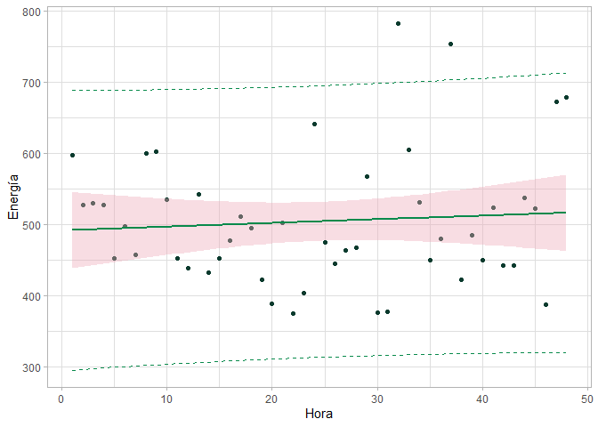<!-- -->
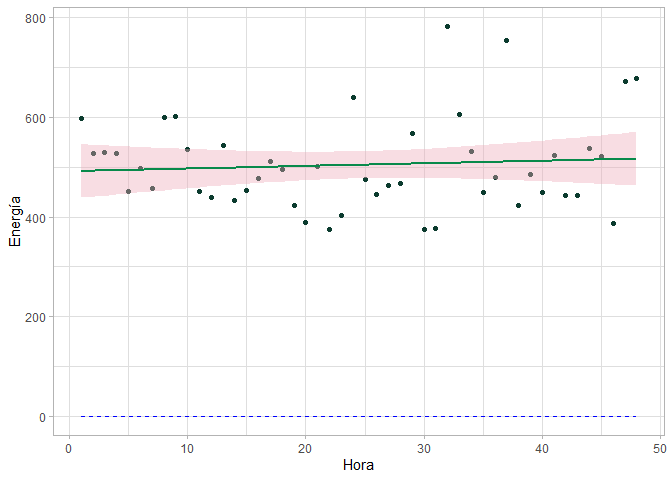<!-- -->


``` r
#Analizamos ambos tipos de intervalos en todos los modelos probados cuando horas=27.5

IC<-predict(linMod,newdata=data.frame(Hora= 27.5),interval="confidence")
IP<-predict(linMod,newdata=data.frame(Hora=27.5),interval="prediction")

print(IC)  
```

```
##        fit      lwr      upr
## 1 505.8125 477.9305 533.6945
```

```
##        fit      lwr      upr
## 1 505.8125 314.9688 696.6563
```

```
##         fit       lwr       upr
## 1 0.7498044 0.7497916 0.7498173
```

```
##         fit       lwr       upr
## 1 0.7498044 0.7497164 0.7498924
```

```
## [1] 487.2974
```

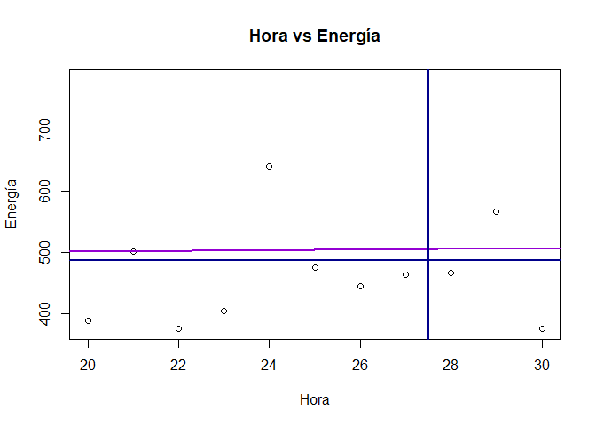<!-- -->

## <span style="color:#18bc9c"> Tratamiento de la heterocedasticidad</span>

### Ejercicio 1.4

<br>
Se obtuvieron datos históricos del mercado inmobiliario de una
ciudad de Nueva Taipei, en Taiwan. La base es inmobiliaria.xlsx .\
<br>
Las características son:<br>
edad: Edad de la propiedad (en años).<br>
distancia: La distancia a la estación de transporte más cercana (en metros).<br> negocios: Cantidad de negocios de conveniencia en las cercanías a
una distancia realizable a pie.<br>
latitud: Latitud de la ubicación de la propiedad (en grados).<br>
longitud: Longitud de la ubicación de la propiedad (en grados).<br>
precio: Precio por metro cuadrado (en miles de dólares).<br>
<br>
Se quiere investigar si el precio de las propiedades puede ser estimado en
función de alguna de las variables disponibles.\
<br>
(a) Analizar si el precio depende de alguna de las variables.\
<br>
(b) Estudiar la linealidad de la relación precio-distancia.\
<br>
(c) Estimar los coeficientes del modelo y realizar el análisis diagnóstico de
los residuos del mismo. Utilizar para este análisis los gráficos de residuos
versus valores ajustados, el qq-plot de los residuos, la grafica de residuos
versus leverage.\
<br>
(d) Aplicar los test de Durbin-Watson Breush-Pagan.\
<br>
(e) Analice la presencia de outlier y verifique si coinciden con los puntos
influyentes.\
<br>
<br>

#### (a)


```
## [1] 409   6
```

<div data-pagedtable="false">
  <script data-pagedtable-source type="application/json">
{"columns":[{"label":[""],"name":["_rn_"],"type":[""],"align":["left"]},{"label":["edad"],"name":[1],"type":["dbl"],"align":["right"]},{"label":["distancia"],"name":[2],"type":["dbl"],"align":["right"]},{"label":["negocios"],"name":[3],"type":["int"],"align":["right"]},{"label":["latitud"],"name":[4],"type":["dbl"],"align":["right"]},{"label":["longitud"],"name":[5],"type":["dbl"],"align":["right"]},{"label":["precio"],"name":[6],"type":["dbl"],"align":["right"]}],"data":[{"1":"32.0","2":"84.87882","3":"10","4":"24.98","5":"121.54","6":"11.5","_rn_":"1"},{"1":"19.5","2":"306.59470","3":"9","4":"24.98","5":"121.54","6":"12.8","_rn_":"2"},{"1":"13.3","2":"561.98450","3":"5","4":"24.99","5":"121.54","6":"14.3","_rn_":"3"}],"options":{"columns":{"min":{},"max":[10]},"rows":{"min":[10],"max":[10]},"pages":{}}}
  </script>
</div>
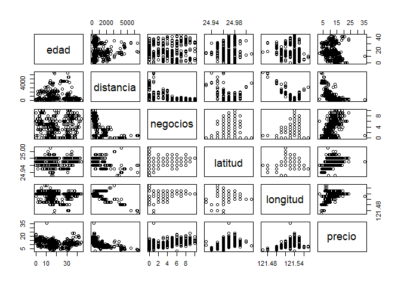<!-- -->

Mirando los gráficos podría decirse que el precio tiene relación con la distancia, los negocios y la edad. 

#### (b)


``` r
#Analizamos la normalidad de las variables.

par(mfrow = c(1, 2))
hist(inmobiliaria$precio, breaks = 10, main = "", xlab = "Precio", border = "#2c3e50")
hist(inmobiliaria$distancia, breaks = 10, main = "", xlab = "Distancia", border = "#18bc9c")
```

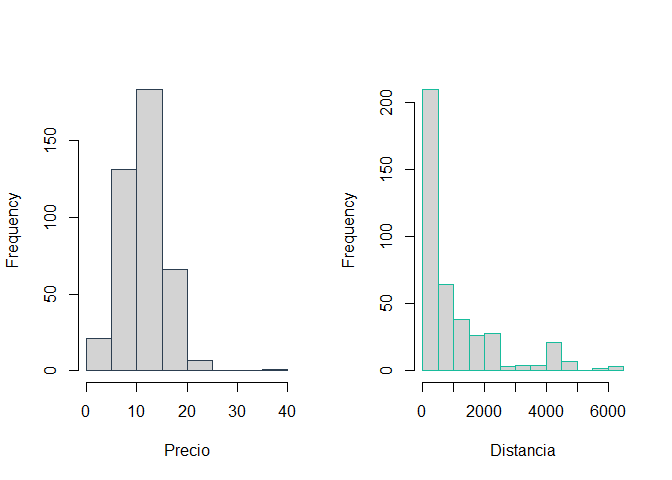<!-- -->


``` r
qqnorm(inmobiliaria$precio, main = "Precio", col = "#2c3e50")
qqline(inmobiliaria$precio)
```

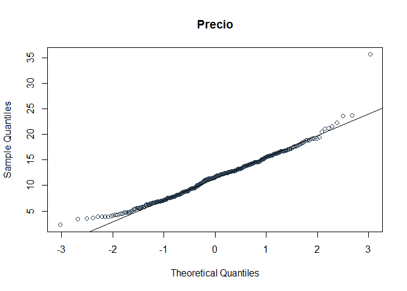<!-- -->

``` r
qqnorm(inmobiliaria$distancia, main = "Distancia", col = "#18bc9c")
qqline(inmobiliaria$distancia)
```

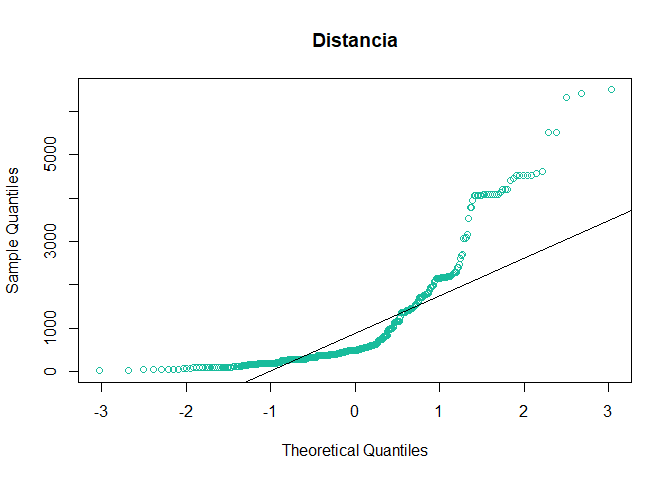<!-- -->

```
## 
## 	Shapiro-Wilk normality test
## 
## data:  inmobiliaria$precio
## W = 0.97236, p-value = 5.265e-07
```

```
## 
## 	Shapiro-Wilk normality test
## 
## data:  inmobiliaria$distancia
## W = 0.73704, p-value < 2.2e-16
```
Análisis de normalidad multivariada - Test de Henze Zirkler


```
## $multivariateNormality
##            Test       HZ p value MVN
## 1 Henze-Zirkler 24.75249       0  NO
## 
## $univariateNormality
##               Test  Variable Statistic   p value Normality
## 1 Anderson-Darling  precio      0.8339  0.0313      NO    
## 2 Anderson-Darling distancia   38.4785  <0.001      NO    
## 
## $Descriptives
##             n       Mean     Std.Dev   Median      Min      Max     25th
## precio    409   11.49951    4.126172  11.6000  2.30000   35.600   8.4000
## distancia 409 1085.41172 1266.420293 492.2313 23.38284 6488.021 289.3248
##               75th     Skew Kurtosis
## precio      14.100 0.602380 2.141236
## distancia 1455.798 1.873478 3.102352
```
<div data-pagedtable="false">
  <script data-pagedtable-source type="application/json">
{"columns":[{"label":["Test"],"name":[1],"type":["chr"],"align":["left"]},{"label":["HZ"],"name":[2],"type":["dbl"],"align":["right"]},{"label":["p value"],"name":[3],"type":["dbl"],"align":["right"]},{"label":["MVN"],"name":[4],"type":["chr"],"align":["left"]}],"data":[{"1":"Henze-Zirkler","2":"24.75249","3":"0","4":"NO"}],"options":{"columns":{"min":{},"max":[10]},"rows":{"min":[10],"max":[10]},"pages":{}}}
  </script>
</div>

Cálculo de correlación


``` r
cor(inmobiliaria$precio, inmobiliaria$distancia, method= "pearson")
```

```
## [1] -0.6721856
```

```
## 
## 	Pearson's product-moment correlation
## 
## data:  inmobiliaria$precio and inmobiliaria$distancia
## t = -18.316, df = 407, p-value < 2.2e-16
## alternative hypothesis: true correlation is not equal to 0
## 95 percent confidence interval:
##  -0.7220865 -0.6153262
## sample estimates:
##        cor 
## -0.6721856
```
Modelo Lineal


```
## 
## Call:
## lm(formula = precio ~ distancia, data = inmobiliaria)
## 
## Residuals:
##      Min       1Q   Median       3Q      Max 
## -10.7154  -1.8492  -0.3407   1.4570  22.2765 
## 
## Coefficients:
##               Estimate Std. Error t value Pr(>|t|)    
## (Intercept) 13.8766423  0.1992948   69.63   <2e-16 ***
## distancia   -0.0021901  0.0001196  -18.32   <2e-16 ***
## ---
## Signif. codes:  0 '***' 0.001 '**' 0.01 '*' 0.05 '.' 0.1 ' ' 1
## 
## Residual standard error: 3.059 on 407 degrees of freedom
## Multiple R-squared:  0.4518,	Adjusted R-squared:  0.4505 
## F-statistic: 335.5 on 1 and 407 DF,  p-value: < 2.2e-16
```
Análisis de la normalidad de los residuos - Test Shapiro Wilk

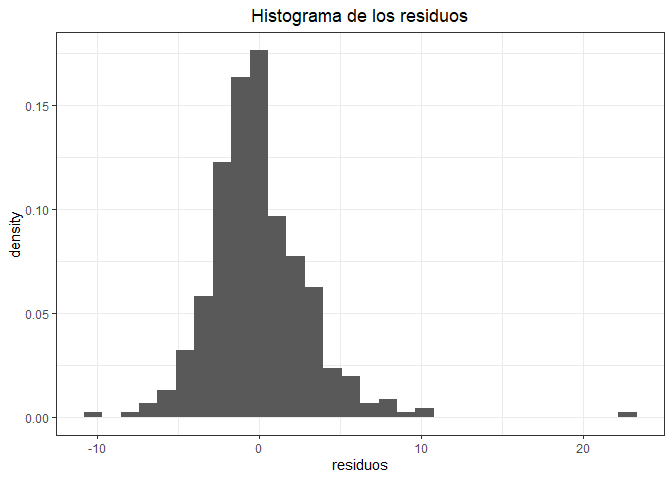<!-- -->


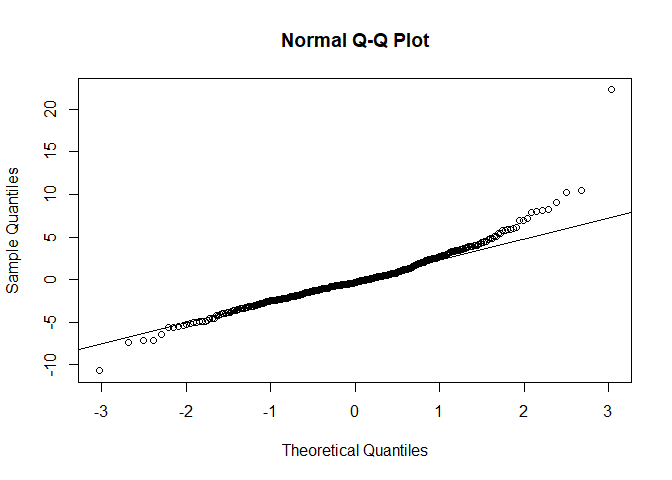<!-- -->

```
## 
## 	Shapiro-Wilk normality test
## 
## data:  modelo_distancia$residuals
## W = 0.93207, p-value = 1.085e-12
```
El p-value es menor a 0.05, por lo que se rechaza la hipótesis nula de normalidad de los residuos. \
<br>

#### (c)

# Ejercicios ppt

<div data-pagedtable="false">
  <script data-pagedtable-source type="application/json">
{"columns":[{"label":["SUPHOJA"],"name":[1],"type":["dbl"],"align":["right"]},{"label":["PESOF"],"name":[2],"type":["dbl"],"align":["right"]},{"label":["LONGF"],"name":[3],"type":["dbl"],"align":["right"]}],"data":[{"1":"44.09","2":"49.29","3":"46.34"},{"1":"36.67","2":"49.00","3":"44.58"},{"1":"51.72","2":"43.04","3":"40.06"}],"options":{"columns":{"min":{},"max":[10]},"rows":{"min":[10],"max":[10]},"pages":{}}}
  </script>
</div>

```
## 
## Call:
## lm(formula = PESOF ~ LONGF, data = damascos)
## 
## Residuals:
##     Min      1Q  Median      3Q     Max 
## -4.6242 -2.5943  0.5176  1.8973  5.1117 
## 
## Coefficients:
##             Estimate Std. Error t value Pr(>|t|)    
## (Intercept) -25.3171     5.8569  -4.323 0.000702 ***
## LONGF         1.7098     0.1403  12.186 7.68e-09 ***
## ---
## Signif. codes:  0 '***' 0.001 '**' 0.01 '*' 0.05 '.' 0.1 ' ' 1
## 
## Residual standard error: 3.175 on 14 degrees of freedom
## Multiple R-squared:  0.9138,	Adjusted R-squared:  0.9077 
## F-statistic: 148.5 on 1 and 14 DF,  p-value: 7.677e-09
```

<div data-pagedtable="false">
  <script data-pagedtable-source type="application/json">
{"columns":[{"label":[""],"name":["_rn_"],"type":[""],"align":["left"]},{"label":["Df"],"name":[1],"type":["int"],"align":["right"]},{"label":["Sum Sq"],"name":[2],"type":["dbl"],"align":["right"]},{"label":["Mean Sq"],"name":[3],"type":["dbl"],"align":["right"]},{"label":["F value"],"name":[4],"type":["dbl"],"align":["right"]},{"label":["Pr(>F)"],"name":[5],"type":["dbl"],"align":["right"]}],"data":[{"1":"1","2":"1497.0748","3":"1497.07482","4":"148.4956","5":"7.676609e-09","_rn_":"LONGF"},{"1":"14","2":"141.1426","3":"10.08161","4":"NA","5":"NA","_rn_":"Residuals"}],"options":{"columns":{"min":{},"max":[10]},"rows":{"min":[10],"max":[10]},"pages":{}}}
  </script>
</div>

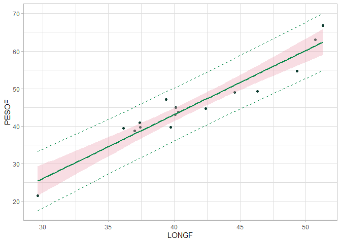<!-- -->

```
## 
## 	Shapiro-Wilk normality test
## 
## data:  residuos
## W = 0.95305, p-value = 0.5394
```

```
## 
## 	Anderson-Darling normality test
## 
## data:  residuos
## A = 0.27592, p-value = 0.6085
```

```
## 
## 	Lilliefors (Kolmogorov-Smirnov) normality test
## 
## data:  residuos
## D = 0.1077, p-value = 0.889
```
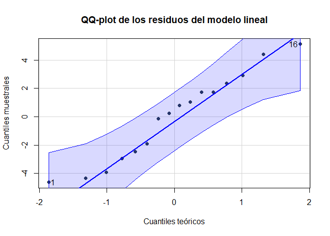<!-- -->

```
## [1] 16  1
```

``` r
#Visualización de los residuos

residuos_df = data.frame(indice = 1:length(residuos), residuos = residuos)

ggplot(residuos_df, aes(x = indice, y = residuos)) +
  geom_point(color = "#2c3e50", size = 2) +
  labs(title = "Gráfico de residuos",
       x = "Índice",
       y = "Residuo") +
  theme_minimal()
```

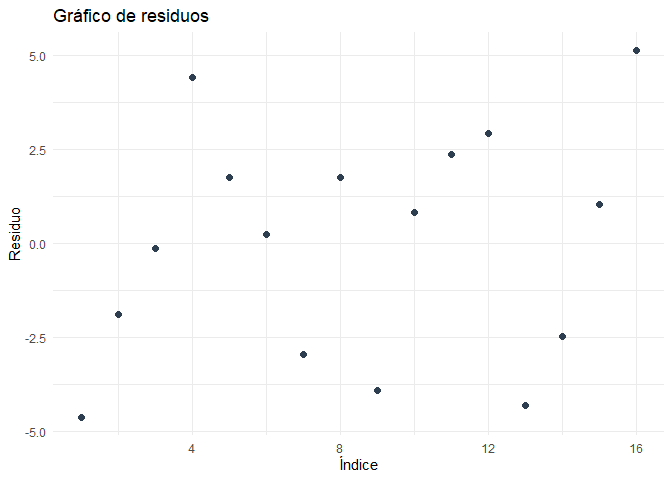<!-- -->

```
## 
## 	Durbin-Watson test
## 
## data:  mod_hojas
## DW = 1.5159, p-value = 0.2612
## alternative hypothesis: true autocorrelation is not 0
```

```
## 
## 	studentized Breusch-Pagan test
## 
## data:  mod_hojas
## BP = 0.84363, df = 1, p-value = 0.3584
```

```
## 
## 	Goldfeld-Quandt test
## 
## data:  mod_hojas
## GQ = 1.5461, df1 = 6, df2 = 6, p-value = 0.305
## alternative hypothesis: variance increases from segment 1 to 2
```
Los dos test de homocedasticidad arrojan que no se puede rechazar la hipótesis nula de homocedasticidad. \
<br> 
Validación gráfica de la homocedasticidad. 


