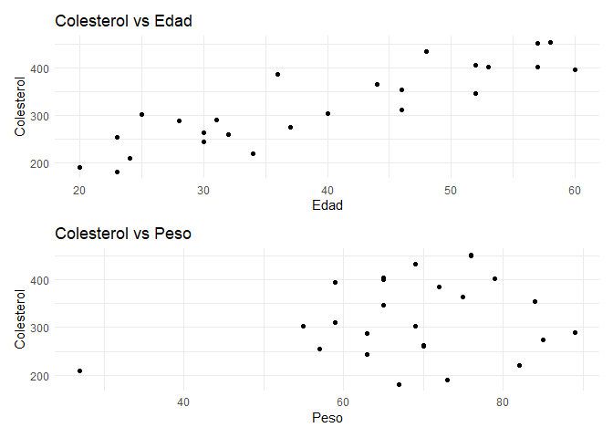

<br>
<br>

# Capítulo 1. Regresión Lineal Simple


<br>

## <span style="color:#18bc9c">Correlación</span>

<br>

### Ejercicio 1.1. \
<br>
En el archivo grasacerdos.xlsx se encuentran los datos del peso
vivo (PV, en Kg) y al espesor de grasa dorsal (EGD, en mm) de 30 lechones
elegidos al azar de una población de porcinos Duroc Jersey del Oeste de la
provincia de Buenos Aires. Se pide: \
<br>
(a) Dibujar el diagrama de dispersión e interpretarlo.\
<br>
(b) Calcular el coeficiente de correlación muestral y explíquelo.\
<br>
(c) ¿Hay suficiente evidencia para admitir asociación entre el peso y el espesor de grasa? $(\alpha = 0,05)$. Verifique los supuestos para decidir el indicador
que va a utilizar.\


```
## # A tibble: 5 × 3
##     Obs PV    EGD  
##   <dbl> <chr> <chr>
## 1     1 56,81 16,19
## 2     2 70,40 22,00
## 3     3 71,73 19,52
## 4     4 75,10 31,00
## 5     5 79,65 23,58
```
Cambiamos las "," por "." y visualizamos cuantos nulos hay  por columna. Convertimos las columnas de PV y EGD a numéricas. Pedimos el summary del dataframe. 


```
## tibble [30 × 3] (S3: tbl_df/tbl/data.frame)
##  $ Obs: num [1:30] 1 2 3 4 5 6 7 8 9 10 ...
##  $ PV : chr [1:30] "56.81" "70.40" "71.73" "75.10" ...
##  $ EGD: chr [1:30] "16.19" "22.00" "19.52" "31.00" ...
## NULL
```

```
## Obs  PV EGD 
##   0   0   0
```

```
##        PV             EGD       
##  Min.   :27.51   Min.   : 7.29  
##  1st Qu.:55.47   1st Qu.:16.47  
##  Median :64.94   Median :21.55  
##  Mean   :63.07   Mean   :21.60  
##  3rd Qu.:70.15   3rd Qu.:25.92  
##  Max.   :93.00   Max.   :40.90
```
<br>

#### (a) 


<!-- -->
<!-- -->
En los datos visualizados  no pareciera haber asociación entre las variables. 

#### (b)
<br>
En primer lugar analizo la normalidad de las variables mediante los gráficos de los histogramas, los qqplots y la prueba de Shapiro.
<!-- -->
<!-- -->

```
## 
## 	Shapiro-Wilk normality test
## 
## data:  PV
## W = 0.97533, p-value = 0.6925
```


```
## 
## 	Shapiro-Wilk normality test
## 
## data:  EGD
## W = 0.98514, p-value = 0.9395
```
Por el test de Shapiro Wilk no se puede rechazar la normalidad de los datos en ninguno de los dos casos. 
<br>
Análisis de la normalidad multivariada - Test de Henze Zirkler


``` r
#Análisis de normalidad bivariada 
library(MVN)
attach(grasacerdos)
peso_egd=data.frame(PV,EGD)
#Usamos Test Henze-Zirkler para evaluar normalidad multivariada (bivariada en este caso)
respuesta_testHZ<-mvn(peso_egd , mvnTest = "hz")
print(respuesta_testHZ$multivariateNormality)
```

```
##            Test        HZ   p value MVN
## 1 Henze-Zirkler 0.2539437 0.9049686 YES
```
El test da por resultado que las variables son normales bivariadas.

La correlación entre ambas variables es:


```
## [1] 0.2543434
```
La correlación entre las variables es baja: Si el valor de r es cercano a 0, indica que no existe una tendencia
creciente o decreciente entre las variables estudiadas.


```
## 
## 	Pearson's product-moment correlation
## 
## data:  PV and EGD
## t = 1.3916, df = 28, p-value = 0.175
## alternative hypothesis: true correlation is not equal to 0
## 95 percent confidence interval:
##  -0.1166112  0.5630217
## sample estimates:
##       cor 
## 0.2543434
```
El test arroja que el valor p de la prueba de Pearson es 0.175. 


```
##            PV       EGD
## PV  1.0000000 0.2543434
## EGD 0.2543434 1.0000000
```
Si bien no es necesario aplicar el coeficiente de Spearman pues se satisfacen los supuestos, igualmente lo hago.


```
## 
## 	Spearman's rank correlation rho
## 
## data:  PV and EGD
## S = 3748, p-value = 0.3785
## alternative hypothesis: true rho is not equal to 0
## sample estimates:
##       rho 
## 0.1661846
```

### Ejercicio 1.2.
<br>

Los datos del cuarteto de Anscombe se encuentran en el archivo
 anscombe.xlsx
 Se pide explorar los datos de la siguiente manera:\
 <br>
 (a) Graficar los cuatro pares de datos en un diagrama de dispersión cada
 uno.\
 <br>
 (b) Hallar los valores medios de las variables para cada para de datos.\
<br> (c) Hallar los valores de la dispersión para cada conjunto de datos.\
 <br>(d) Hallar el coeficiente muestral de correlación lineal en cada caso.\
 <br>(e) Observar, comentar y concluir.\
 <br>
 
#### (a)


<!-- -->

#### (b)


```{=html}
<div id="okukhbpeub" style="padding-left:0px;padding-right:0px;padding-top:10px;padding-bottom:10px;overflow-x:auto;overflow-y:auto;width:auto;height:auto;">
<style>#okukhbpeub table {
  font-family: system-ui, 'Segoe UI', Roboto, Helvetica, Arial, sans-serif, 'Apple Color Emoji', 'Segoe UI Emoji', 'Segoe UI Symbol', 'Noto Color Emoji';
  -webkit-font-smoothing: antialiased;
  -moz-osx-font-smoothing: grayscale;
}

#okukhbpeub thead, #okukhbpeub tbody, #okukhbpeub tfoot, #okukhbpeub tr, #okukhbpeub td, #okukhbpeub th {
  border-style: none;
}

#okukhbpeub p {
  margin: 0;
  padding: 0;
}

#okukhbpeub .gt_table {
  display: table;
  border-collapse: collapse;
  line-height: normal;
  margin-left: auto;
  margin-right: auto;
  color: #333333;
  font-size: 16px;
  font-weight: normal;
  font-style: normal;
  background-color: #FFFFFF;
  width: auto;
  border-top-style: solid;
  border-top-width: 2px;
  border-top-color: #A8A8A8;
  border-right-style: none;
  border-right-width: 2px;
  border-right-color: #D3D3D3;
  border-bottom-style: solid;
  border-bottom-width: 2px;
  border-bottom-color: #A8A8A8;
  border-left-style: none;
  border-left-width: 2px;
  border-left-color: #D3D3D3;
}

#okukhbpeub .gt_caption {
  padding-top: 4px;
  padding-bottom: 4px;
}

#okukhbpeub .gt_title {
  color: #333333;
  font-size: 125%;
  font-weight: initial;
  padding-top: 4px;
  padding-bottom: 4px;
  padding-left: 5px;
  padding-right: 5px;
  border-bottom-color: #FFFFFF;
  border-bottom-width: 0;
}

#okukhbpeub .gt_subtitle {
  color: #333333;
  font-size: 85%;
  font-weight: initial;
  padding-top: 3px;
  padding-bottom: 5px;
  padding-left: 5px;
  padding-right: 5px;
  border-top-color: #FFFFFF;
  border-top-width: 0;
}

#okukhbpeub .gt_heading {
  background-color: #FFFFFF;
  text-align: center;
  border-bottom-color: #FFFFFF;
  border-left-style: none;
  border-left-width: 1px;
  border-left-color: #D3D3D3;
  border-right-style: none;
  border-right-width: 1px;
  border-right-color: #D3D3D3;
}

#okukhbpeub .gt_bottom_border {
  border-bottom-style: solid;
  border-bottom-width: 2px;
  border-bottom-color: #D3D3D3;
}

#okukhbpeub .gt_col_headings {
  border-top-style: solid;
  border-top-width: 2px;
  border-top-color: #D3D3D3;
  border-bottom-style: solid;
  border-bottom-width: 2px;
  border-bottom-color: #D3D3D3;
  border-left-style: none;
  border-left-width: 1px;
  border-left-color: #D3D3D3;
  border-right-style: none;
  border-right-width: 1px;
  border-right-color: #D3D3D3;
}

#okukhbpeub .gt_col_heading {
  color: #333333;
  background-color: #FFFFFF;
  font-size: 100%;
  font-weight: normal;
  text-transform: inherit;
  border-left-style: none;
  border-left-width: 1px;
  border-left-color: #D3D3D3;
  border-right-style: none;
  border-right-width: 1px;
  border-right-color: #D3D3D3;
  vertical-align: bottom;
  padding-top: 5px;
  padding-bottom: 6px;
  padding-left: 5px;
  padding-right: 5px;
  overflow-x: hidden;
}

#okukhbpeub .gt_column_spanner_outer {
  color: #333333;
  background-color: #FFFFFF;
  font-size: 100%;
  font-weight: normal;
  text-transform: inherit;
  padding-top: 0;
  padding-bottom: 0;
  padding-left: 4px;
  padding-right: 4px;
}

#okukhbpeub .gt_column_spanner_outer:first-child {
  padding-left: 0;
}

#okukhbpeub .gt_column_spanner_outer:last-child {
  padding-right: 0;
}

#okukhbpeub .gt_column_spanner {
  border-bottom-style: solid;
  border-bottom-width: 2px;
  border-bottom-color: #D3D3D3;
  vertical-align: bottom;
  padding-top: 5px;
  padding-bottom: 5px;
  overflow-x: hidden;
  display: inline-block;
  width: 100%;
}

#okukhbpeub .gt_spanner_row {
  border-bottom-style: hidden;
}

#okukhbpeub .gt_group_heading {
  padding-top: 8px;
  padding-bottom: 8px;
  padding-left: 5px;
  padding-right: 5px;
  color: #333333;
  background-color: #FFFFFF;
  font-size: 100%;
  font-weight: initial;
  text-transform: inherit;
  border-top-style: solid;
  border-top-width: 2px;
  border-top-color: #D3D3D3;
  border-bottom-style: solid;
  border-bottom-width: 2px;
  border-bottom-color: #D3D3D3;
  border-left-style: none;
  border-left-width: 1px;
  border-left-color: #D3D3D3;
  border-right-style: none;
  border-right-width: 1px;
  border-right-color: #D3D3D3;
  vertical-align: middle;
  text-align: left;
}

#okukhbpeub .gt_empty_group_heading {
  padding: 0.5px;
  color: #333333;
  background-color: #FFFFFF;
  font-size: 100%;
  font-weight: initial;
  border-top-style: solid;
  border-top-width: 2px;
  border-top-color: #D3D3D3;
  border-bottom-style: solid;
  border-bottom-width: 2px;
  border-bottom-color: #D3D3D3;
  vertical-align: middle;
}

#okukhbpeub .gt_from_md > :first-child {
  margin-top: 0;
}

#okukhbpeub .gt_from_md > :last-child {
  margin-bottom: 0;
}

#okukhbpeub .gt_row {
  padding-top: 8px;
  padding-bottom: 8px;
  padding-left: 5px;
  padding-right: 5px;
  margin: 10px;
  border-top-style: solid;
  border-top-width: 1px;
  border-top-color: #D3D3D3;
  border-left-style: none;
  border-left-width: 1px;
  border-left-color: #D3D3D3;
  border-right-style: none;
  border-right-width: 1px;
  border-right-color: #D3D3D3;
  vertical-align: middle;
  overflow-x: hidden;
}

#okukhbpeub .gt_stub {
  color: #333333;
  background-color: #FFFFFF;
  font-size: 100%;
  font-weight: initial;
  text-transform: inherit;
  border-right-style: solid;
  border-right-width: 2px;
  border-right-color: #D3D3D3;
  padding-left: 5px;
  padding-right: 5px;
}

#okukhbpeub .gt_stub_row_group {
  color: #333333;
  background-color: #FFFFFF;
  font-size: 100%;
  font-weight: initial;
  text-transform: inherit;
  border-right-style: solid;
  border-right-width: 2px;
  border-right-color: #D3D3D3;
  padding-left: 5px;
  padding-right: 5px;
  vertical-align: top;
}

#okukhbpeub .gt_row_group_first td {
  border-top-width: 2px;
}

#okukhbpeub .gt_row_group_first th {
  border-top-width: 2px;
}

#okukhbpeub .gt_summary_row {
  color: #333333;
  background-color: #FFFFFF;
  text-transform: inherit;
  padding-top: 8px;
  padding-bottom: 8px;
  padding-left: 5px;
  padding-right: 5px;
}

#okukhbpeub .gt_first_summary_row {
  border-top-style: solid;
  border-top-color: #D3D3D3;
}

#okukhbpeub .gt_first_summary_row.thick {
  border-top-width: 2px;
}

#okukhbpeub .gt_last_summary_row {
  padding-top: 8px;
  padding-bottom: 8px;
  padding-left: 5px;
  padding-right: 5px;
  border-bottom-style: solid;
  border-bottom-width: 2px;
  border-bottom-color: #D3D3D3;
}

#okukhbpeub .gt_grand_summary_row {
  color: #333333;
  background-color: #FFFFFF;
  text-transform: inherit;
  padding-top: 8px;
  padding-bottom: 8px;
  padding-left: 5px;
  padding-right: 5px;
}

#okukhbpeub .gt_first_grand_summary_row {
  padding-top: 8px;
  padding-bottom: 8px;
  padding-left: 5px;
  padding-right: 5px;
  border-top-style: double;
  border-top-width: 6px;
  border-top-color: #D3D3D3;
}

#okukhbpeub .gt_last_grand_summary_row_top {
  padding-top: 8px;
  padding-bottom: 8px;
  padding-left: 5px;
  padding-right: 5px;
  border-bottom-style: double;
  border-bottom-width: 6px;
  border-bottom-color: #D3D3D3;
}

#okukhbpeub .gt_striped {
  background-color: rgba(128, 128, 128, 0.05);
}

#okukhbpeub .gt_table_body {
  border-top-style: solid;
  border-top-width: 2px;
  border-top-color: #D3D3D3;
  border-bottom-style: solid;
  border-bottom-width: 2px;
  border-bottom-color: #D3D3D3;
}

#okukhbpeub .gt_footnotes {
  color: #333333;
  background-color: #FFFFFF;
  border-bottom-style: none;
  border-bottom-width: 2px;
  border-bottom-color: #D3D3D3;
  border-left-style: none;
  border-left-width: 2px;
  border-left-color: #D3D3D3;
  border-right-style: none;
  border-right-width: 2px;
  border-right-color: #D3D3D3;
}

#okukhbpeub .gt_footnote {
  margin: 0px;
  font-size: 90%;
  padding-top: 4px;
  padding-bottom: 4px;
  padding-left: 5px;
  padding-right: 5px;
}

#okukhbpeub .gt_sourcenotes {
  color: #333333;
  background-color: #FFFFFF;
  border-bottom-style: none;
  border-bottom-width: 2px;
  border-bottom-color: #D3D3D3;
  border-left-style: none;
  border-left-width: 2px;
  border-left-color: #D3D3D3;
  border-right-style: none;
  border-right-width: 2px;
  border-right-color: #D3D3D3;
}

#okukhbpeub .gt_sourcenote {
  font-size: 90%;
  padding-top: 4px;
  padding-bottom: 4px;
  padding-left: 5px;
  padding-right: 5px;
}

#okukhbpeub .gt_left {
  text-align: left;
}

#okukhbpeub .gt_center {
  text-align: center;
}

#okukhbpeub .gt_right {
  text-align: right;
  font-variant-numeric: tabular-nums;
}

#okukhbpeub .gt_font_normal {
  font-weight: normal;
}

#okukhbpeub .gt_font_bold {
  font-weight: bold;
}

#okukhbpeub .gt_font_italic {
  font-style: italic;
}

#okukhbpeub .gt_super {
  font-size: 65%;
}

#okukhbpeub .gt_footnote_marks {
  font-size: 75%;
  vertical-align: 0.4em;
  position: initial;
}

#okukhbpeub .gt_asterisk {
  font-size: 100%;
  vertical-align: 0;
}

#okukhbpeub .gt_indent_1 {
  text-indent: 5px;
}

#okukhbpeub .gt_indent_2 {
  text-indent: 10px;
}

#okukhbpeub .gt_indent_3 {
  text-indent: 15px;
}

#okukhbpeub .gt_indent_4 {
  text-indent: 20px;
}

#okukhbpeub .gt_indent_5 {
  text-indent: 25px;
}

#okukhbpeub .katex-display {
  display: inline-flex !important;
  margin-bottom: 0.75em !important;
}

#okukhbpeub div.Reactable > div.rt-table > div.rt-thead > div.rt-tr.rt-tr-group-header > div.rt-th-group:after {
  height: 0px !important;
}
</style>
<table class="gt_table" data-quarto-disable-processing="false" data-quarto-bootstrap="false">
  <thead>
    <tr class="gt_col_headings">
      <th class="gt_col_heading gt_columns_bottom_border gt_left" rowspan="1" colspan="1" scope="col" id="Grupo">Grupo</th>
      <th class="gt_col_heading gt_columns_bottom_border gt_right" rowspan="1" colspan="1" scope="col" id="media_x">media_x</th>
      <th class="gt_col_heading gt_columns_bottom_border gt_right" rowspan="1" colspan="1" scope="col" id="media_y">media_y</th>
      <th class="gt_col_heading gt_columns_bottom_border gt_right" rowspan="1" colspan="1" scope="col" id="var_x">var_x</th>
      <th class="gt_col_heading gt_columns_bottom_border gt_right" rowspan="1" colspan="1" scope="col" id="var_y">var_y</th>
      <th class="gt_col_heading gt_columns_bottom_border gt_right" rowspan="1" colspan="1" scope="col" id="correl">correl</th>
      <th class="gt_col_heading gt_columns_bottom_border gt_right" rowspan="1" colspan="1" scope="col" id="rcuad">rcuad</th>
    </tr>
  </thead>
  <tbody class="gt_table_body">
    <tr><td headers="Grupo" class="gt_row gt_left">Grupo 1</td>
<td headers="media_x" class="gt_row gt_right">9</td>
<td headers="media_y" class="gt_row gt_right">7.500909</td>
<td headers="var_x" class="gt_row gt_right">11</td>
<td headers="var_y" class="gt_row gt_right">4.127269</td>
<td headers="correl" class="gt_row gt_right">0.8164205</td>
<td headers="rcuad" class="gt_row gt_right">0.6665425</td></tr>
    <tr><td headers="Grupo" class="gt_row gt_left">Grupo 2</td>
<td headers="media_x" class="gt_row gt_right">9</td>
<td headers="media_y" class="gt_row gt_right">7.500909</td>
<td headers="var_x" class="gt_row gt_right">11</td>
<td headers="var_y" class="gt_row gt_right">4.127629</td>
<td headers="correl" class="gt_row gt_right">0.8162365</td>
<td headers="rcuad" class="gt_row gt_right">0.6662420</td></tr>
    <tr><td headers="Grupo" class="gt_row gt_left">Grupo 3</td>
<td headers="media_x" class="gt_row gt_right">9</td>
<td headers="media_y" class="gt_row gt_right">7.500000</td>
<td headers="var_x" class="gt_row gt_right">11</td>
<td headers="var_y" class="gt_row gt_right">4.122620</td>
<td headers="correl" class="gt_row gt_right">0.8162867</td>
<td headers="rcuad" class="gt_row gt_right">0.6663240</td></tr>
    <tr><td headers="Grupo" class="gt_row gt_left">Grupo 4</td>
<td headers="media_x" class="gt_row gt_right">9</td>
<td headers="media_y" class="gt_row gt_right">7.500909</td>
<td headers="var_x" class="gt_row gt_right">11</td>
<td headers="var_y" class="gt_row gt_right">4.123249</td>
<td headers="correl" class="gt_row gt_right">0.8165214</td>
<td headers="rcuad" class="gt_row gt_right">0.6667073</td></tr>
  </tbody>
  
  
</table>
</div>
```
## <span style="color:#18bc9c"> Modelo Lineal Simple</span>
<br>

### Ejercicio 1.3. \
<br>
El archivo peso_edad_colest.xlsx disponible en contiene regis
tros correspondientes a 25 individuos respecto de su peso, su edad y el nivel
 de colesterol total en sangre.
 Se pide: \
 <br>
 (a) Realizar el diagrama de dispersión de colesterol en función de la edad y
 de colesterol en función de peso. Le parece adecuado ajustar un modelo
 lineal para alguno de estos dos pares de variables?\
  <br>
 (b) Estime los coeficientes del modelo lineal para el colesterol en función de
 la edad.\
  <br>
 (c) Estime intervalos de confianza del 95% para los coeficientes del modelo
 y compare estos resultados con el test de Wald para los coeficientes. Le
 parece que hay asociación entre estos test y el test de la regresión?\
  <br>
 (d) A partir de esta recta estime los valores de E(Y) para x = 25 años y
 x =48años. Podría estimarse el valor de E(Y) para x = 80 años? \
  <br>
 (e) Testee la normalidad de los residuos y haga un gráfico para ver si son
 homocedásticos.\
  <br>

#### (a)

<!-- -->
Viendo los gráficos de dispersión, pareciera  que el colesterol en función de la edad tiene una relación lineal más clara que el colesterol en función del peso. Por lo tanto, es más adecuado ajustar un modelo lineal para el colesterol en función de la edad.  

#### (b)


```
## 
## Call:
## lm(formula = colest ~ edad, data = peso_edad_colest)
## 
## Residuals:
##     Min      1Q  Median      3Q     Max 
## -68.311 -22.602  -2.627  27.589  85.348 
## 
## Coefficients:
##             Estimate Std. Error t value Pr(>|t|)    
## (Intercept)  95.5020    26.2545   3.638  0.00138 ** 
## edad          5.6708     0.6345   8.937 6.09e-09 ***
## ---
## Signif. codes:  0 '***' 0.001 '**' 0.01 '*' 0.05 '.' 0.1 ' ' 1
## 
## Residual standard error: 39.69 on 23 degrees of freedom
## Multiple R-squared:  0.7764,	Adjusted R-squared:  0.7667 
## F-statistic: 79.87 on 1 and 23 DF,  p-value: 6.094e-09
```

####(c)
